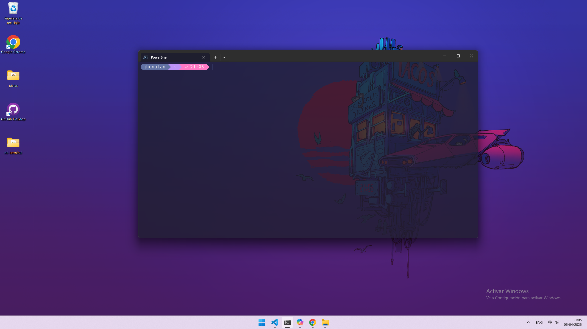
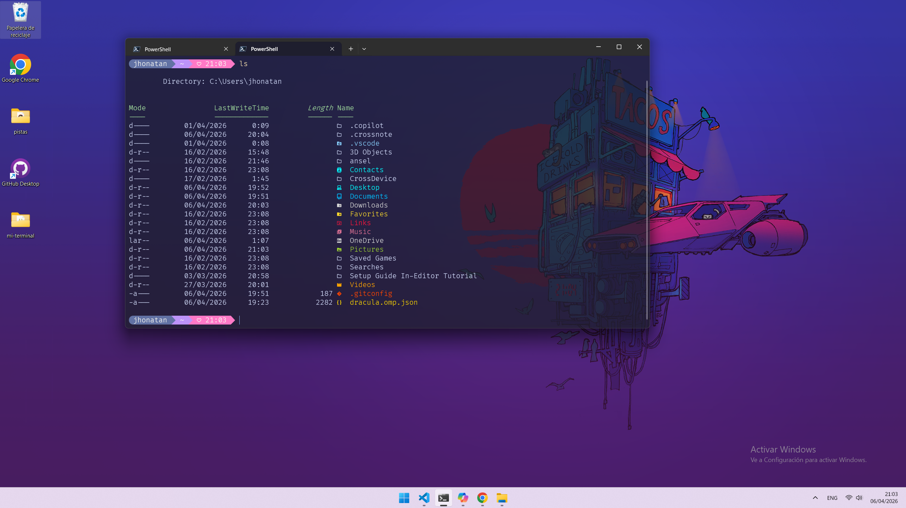
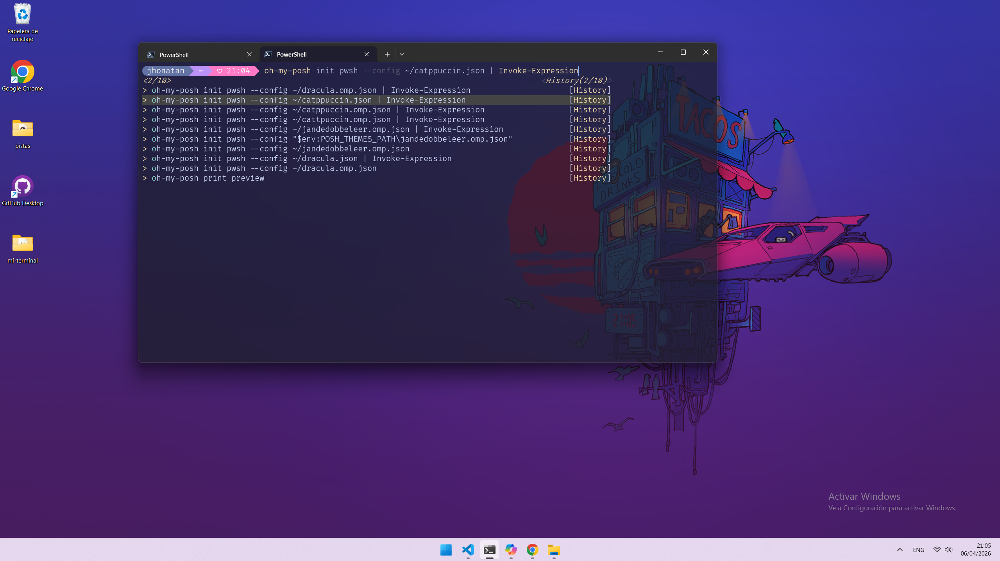
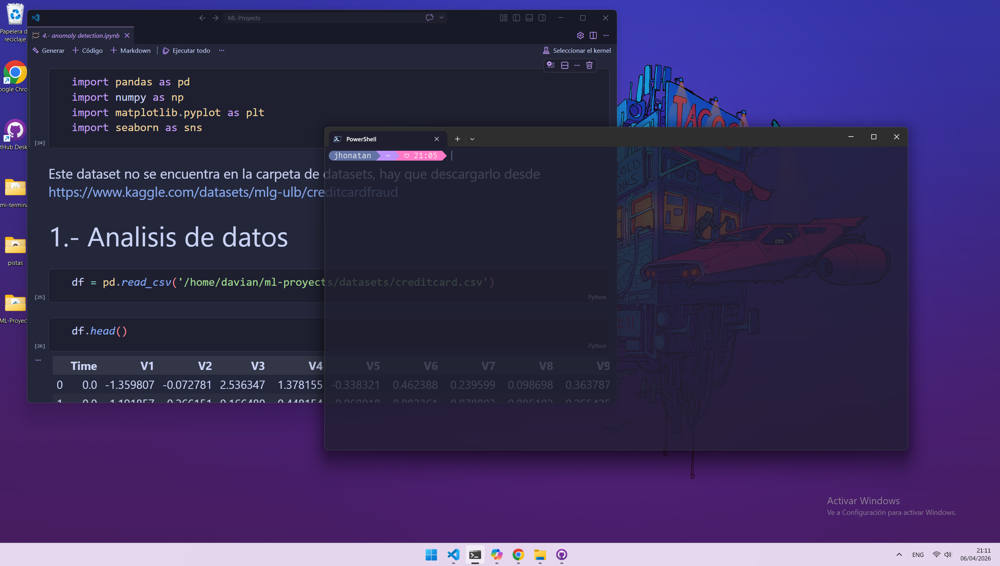

# 💻 Mi configuración de terminal powershell



Este repositorio contiene mi configuración completa de terminal en Windows, enfocada en productividad, minimalismo y una experiencia moderna en PowerShell.

---

## ✨ Características

* ⚡ Prompt moderno con **Starship**
* 🎨 Esquema de colores **Catppuccin**
* 🔤 Fuente **Nerd Font** para iconos
* 📁 Iconos en la terminal con **Terminal-Icons**
* 🔮 Predicción de comandos estilo lista (PSReadLine)
* 🖥️ Configuración personalizada de **Windows Terminal**

---

## 🚀 Instalación

Todas las instalaciones están automatizadas en el archivo `install.ps1`.

### 1️⃣ Ejecutar instalación

```powershell
Set-ExecutionPolicy RemoteSigned -Scope CurrentUser
.\install.ps1
```

---

## 📦 Qué instala `install.ps1`

```powershell
# Instalar Terminal-Icons
Install-Module -Name Terminal-Icons -Scope CurrentUser -Force

# Instalar fuente Nerd Font
oh-my-posh font install

# Predicción de comandos estilo lista
Set-PSReadLineOption -PredictionViewStyle ListView

# Instalar Starship prompt
winget install --id Starship.Starship

# Crear archivo de perfil
New-Item -Path $PROFILE -Type File -Force | Out-Null
```

---

## ⚙️ Configuración del perfil (`profile.ps1`)

Este archivo configura el comportamiento de PowerShell al iniciar:

```powershell
# Iniciar Starship
Invoke-Expression (&starship init powershell)

# Importar iconos
Import-Module -Name Terminal-Icons

# Predicción de comandos estilo lista
Set-PSReadLineOption -PredictionViewStyle ListView
```

---

## 🎨 Configuración de Windows Terminal

Este repositorio incluye un archivo `settings.json` con:

* Esquemas de color **Catppuccin (Latte, Macchiato, Mocha)**
* Fuente: `FiraCode Nerd Font Mono`
* Transparencia y personalización visual
* Atajos de teclado personalizados (aun no añadidos)

### ✔️ Aplicarlo:

1. Abre **Windows Terminal**
2. Ve a **Configuración**
3. Haz clic en **"Abrir archivo JSON"**
4. Reemplaza o integra el contenido de `settings.json`

---

## 🖼️ Preview





---

## ⚠️ Requisitos

* PowerShell 7+
* Windows Terminal
* winget instalado

---

## 📬 Contacto

* 📧 Email: [jhonyprius@gmail.com](mailto:jhonyprius@gmail.com)
* 💼 LinkedIn: https://www.linkedin.com/in/danilchuk-jhonatan/

